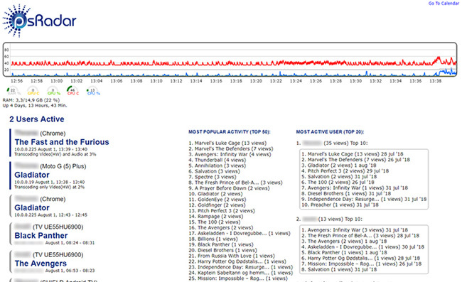
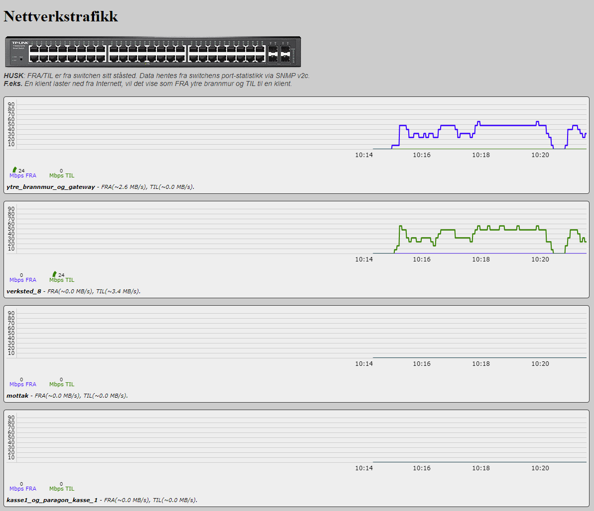

## GrafJS

Et grafsystem jeg lagde med HTML5 canvas, CSS og JavaScript. 
 
Jeg prøvde å finne tredjepartsløsninger for å spare tid, men de endte alle opp med å spise opp for mye CPU og til og med krasje over tid. 
Samt de kjørte på det jeg vurderte som unødvendig tunge/store rammeverk. 
 
GrafJS støtter et konfigurerbart antall verdier og grafer. Dynamisk breddetilpasning. 
Prosentbasert (1-100 verdier). Minimale ytelseskrav. 
 
 
 
 
 
 
 
[Eksempel](https://djnedrelid.github.io/GrafJS/)